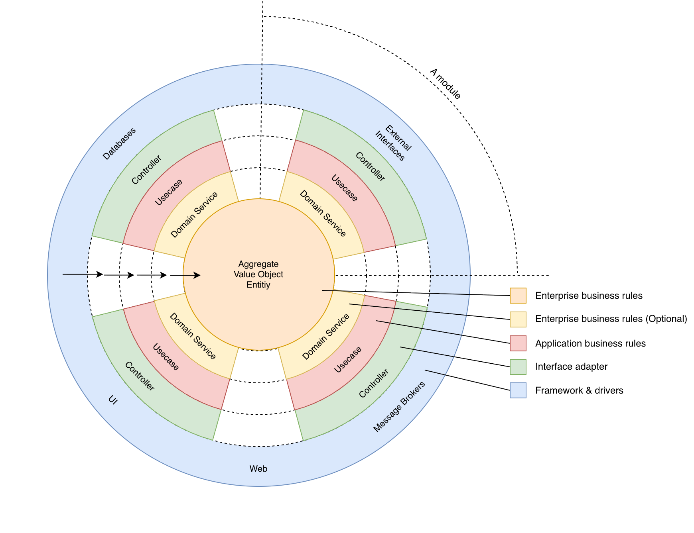

# NestJS + Bun Microservice Template

[](https://www.typescriptlang.org/)
[](https://nestjs.com/)
[](https://bun.sh/)
[](LICENSE)

> A production-ready NestJS + Bun microservice template demonstrating Clean Architecture, CQRS, Domain-Driven Design, multi-database support, and event-driven architecture with comprehensive testing and deployment infrastructure.

---

## Table of Contents

- [Features](#features)
- [Architecture Overview](#architecture-overview)
- [Technology Stack](#technology-stack)
- [Quick Start](#quick-start)
- [Getting Started](#getting-started)
- [Project Structure](#project-structure)
- [Example Modules](#example-modules)
- [Documentation](#documentation)
- [API Endpoints](#api-endpoints)
- [Environment Variables](#environment-variables)
- [Troubleshooting](#troubleshooting)
- [Contributing](#contributing)
- [License](#license)
- [Resources](#resources)
- [Support](#support)

---

## Features

- **Clean Architecture + CQRS + DDD** - Proper separation of concerns with domain-driven design
- **Multi-Database Support** - PostgreSQL (TypeORM) + MongoDB (Mongoose) with repository pattern
- **Multi-Transport** - HTTP (REST), Kafka (event-driven), gRPC-ready
- **Domain Event-Driven** - Automatic Kafka publishing with Factory+Explorer pattern for handlers
- **Production-Ready** - Security-hardened Docker, Kubernetes manifests, health checks
- **Comprehensive Testing** - Unit tests (Jest + @golevelup/ts-jest), E2E tests with Docker Compose
- **Extensive Documentation** - Detailed coding standards, architecture guides, deployment guides
- **Quality-First** - ESLint, Prettier, Husky pre-commit hooks, strict TypeScript

---

## Architecture Overview

This template implements **Clean Architecture** with four layers:



**Key Architectural Patterns:**

- **CQRS** - Commands for cross-module communication
- **Repository Pattern** - Abstract data access with DI tokens
- **Factory Pattern** - Dynamic strategy selection (Symbol tokens, Map registry)
- **Factory + Explorer Pattern** - Auto-discovery with custom decorators (AuditLog module)
- **Domain Events** - Auto-publishing to Kafka via EventBus

**Request Flow:**

```
HTTP/Kafka → Controller → Use Case → Repository Interface → Repository Implementation
                              ↓
                        EventBus.publish(DomainEvent) → Kafka Topic
```

For comprehensive architecture documentation, see [Application Design Guide](docs/systems/application-design.md).

---

## Technology Stack

| Category           | Technology                                       |
| ------------------ | ------------------------------------------------ |
| **Runtime**        | Bun 1.x (Node.js ≥20.0.0 compatible)             |
| **Framework**      | NestJS 11.x, TypeScript 5.2+                     |
| **Databases**      | PostgreSQL (TypeORM 0.3), MongoDB (Mongoose 7.x) |
| **Caching**        | Redis (IORedis)                                  |
| **Message Broker** | Kafka (KafkaJS 2.x)                              |
| **Testing**        | Jest 29.x, @golevelup/ts-jest, Supertest         |
| **Logging**        | Pino 9.x (structured JSON logs)                  |
| **Health Checks**  | NestJS Terminus                                  |
| **Code Quality**   | ESLint 9.x, Prettier 3.x, Husky                  |
| **Transport**      | HTTP (Express), Kafka, gRPC (scaffolded)         |

---

## Quick Start

For experienced developers who want to get running immediately:

```bash
bun install && cp .env.example .env && docker compose up -d && bun run migration:run && bun run start:dev
```

Then verify: `curl http://localhost:3000/health`

For detailed setup instructions, see [Getting Started](#getting-started) below.

---

## Getting Started

### Prerequisites

- **Bun** ≥ 1.0.0 ([Install Bun](https://bun.sh/docs/installation))
- **Docker** & **Docker Compose** (for databases and E2E tests)
- **Node.js** ≥ 20.0.0 (optional, for compatibility)

### Installation

1. **Clone the repository**

   ```bash
   git clone https://github.com/thuantan2060/bmad-nestjs-boilerplate.git
   cd bmad-nestjs-boilerplate
   ```

2. **Install dependencies**

   ```bash
   bun install
   ```

3. **Environment setup**

   ```bash
   cp .env.example .env
   # Edit .env with your configuration
   ```

4. **Start infrastructure services**

   ```bash
   docker compose up -d
   ```

5. **Run database migrations**

   ```bash
   bun run migration:run
   ```

6. **Start the application**

   ```bash
   # Development mode (watch)
   bun run start:dev

   # Production build
   bun run build
   bun run start
   ```

7. **Verify health**

   ```bash
   curl http://localhost:3000/health
   ```

   Expected response:

   ```json
   {
     "status": "ok",
     "info": {
       "application": { "status": "up" },
       "redis": { "status": "up" }
     }
   }
   ```

---

## Project Structure

```
src/
├── modules/                    # Business modules
│   ├── blog/                  # Blog CRUD (PostgreSQL + Domain Events)
│   ├── comment/               # Comment CRUD (MongoDB + Domain Events)
│   └── audit-log/             # Audit logging (Kafka consumer, Factory+Explorer)
│
├── shared/                     # Shared infrastructure
│   ├── domain/                # Entities, Repository interfaces, API interfaces
│   ├── postgres/              # PostgreSQL infrastructure (schemas, repos, migrations)
│   ├── mongo/                 # MongoDB infrastructure (schemas, repos)
│   ├── config/                # Configuration with Joi validation
│   ├── logger/                # Custom Pino logger with interceptors
│   ├── health/                # Health checks (Redis + custom)
│   ├── event/                 # Domain event auto-publishing to Kafka
│   ├── api/                   # External API implementations
│   └── common/                # Common utilities, base classes
│
├── utils/                      # Application utilities
│   ├── api-http.response.ts   # HTTP response wrapper
│   ├── api-rpc.response.ts    # Kafka/gRPC response wrapper
│   ├── error.code.ts          # Centralized error codes
│   └── config/                # Logger, Redis configs
│
└── main.ts                     # Application bootstrap
```

For detailed structure explanation, see [Application Design Guide](docs/systems/application-design.md).

---

## Example Modules

This template includes three interconnected modules demonstrating Clean Architecture and domain events:

### 1. Blog Module (PostgreSQL)

**Purpose:** Demonstrates PostgreSQL CRUD with domain event publishing

**Features:**

- Full CRUD operations (`POST`, `GET`, `PUT`, `DELETE /blogs`)
- Soft-delete pattern (`isValid` field)
- Domain events: `BlogCreatedEvent`, `BlogUpdatedEvent`, `BlogDeletedEvent`
- Auto-publishes to Kafka topic: `org-{env}-domain-event`
- Request/Response models, Presenters, validation

**Key Files:**

- Use Cases: `src/modules/blog/usecases/`
- Controller: `src/modules/blog/blog.controller.ts`
- Events: `src/modules/blog/events/`
- Repository: `src/shared/postgres/repository/blog.repository.impl.ts`

### 2. Comment Module (MongoDB)

**Purpose:** Demonstrates MongoDB CRUD with cross-module validation

**Features:**

- Full CRUD operations (`POST`, `GET`, `PUT`, `DELETE /comments`)
- Validates blog existence before creating comment
- Domain events: `CommentCreatedEvent`, `CommentDeletedEvent`
- MongoDB Mongoose schemas

**Key Files:**

- Use Cases: `src/modules/comment/usecases/`
- Controller: `src/modules/comment/comment.controller.ts`
- Events: `src/modules/comment/events/`
- Repository: `src/shared/mongo/repositories/comment.repository.impl.ts`

### 3. AuditLog Module (MongoDB + Kafka Consumer)

**Purpose:** Demonstrates event-driven architecture with Factory+Explorer pattern

**Features:**

- Listens to all domain events via Kafka topic `org-{env}-domain-event`
- Automatic handler discovery using custom decorators
- Factory pattern routes events to specific handlers by event code
- Stores audit logs in MongoDB for traceability
- Read-only API (`GET /audit-logs`)

**Key Files:**

- Handlers: `src/modules/audit-log/usecases/domain-event-handlers/`
- Factory: `src/modules/audit-log/usecases/domain-event-handlers/domain-event-handler.factory.ts`
- Explorer: `src/modules/audit-log/usecases/domain-event-handlers/domain-event-handler.explorer.ts`
- Repository: `src/shared/mongo/repositories/audit-log.repository.impl.ts`

**Event Flow Example:**

```
Blog Created → BlogCreatedEvent → EventBus → Kafka → AuditLog Consumer
                                                     → Factory → BlogCreatedHandler
                                                              → Create Audit Log
```

---

## Documentation

### Standards Documentation (`docs/standards/`)

**MANDATORY reading before development** - see [Standards Index](docs/standards/index.md)

**Backend Standards:**

- [Coding Style](docs/standards/backend/coding-style.md) - Naming, SOLID, TypeScript
- [Error Handling](docs/standards/backend/error-handling.md) - No try-catch for logging, let errors bubble
- [Logging](docs/standards/backend/logging.md) - Minimal logging, structured JSON
- [Validation](docs/standards/backend/validation.md) - class-validator with ErrorCode context
- [Domain Events](docs/standards/backend/domain-events.md) - Event codes, auto Kafka publishing
- [Use Cases](docs/standards/backend/usecases.md) - CQRS, HttpApiResponse<T>, rollback pattern
- [Kafka](docs/standards/backend/kafka.md) - Auto offsets, error propagation
- [Design Patterns](docs/standards/backend/) - Factory, Factory+Explorer, Chain of Responsibility

**Testing Standards:**

- [Unit Testing](docs/standards/testing/unit-testing.md) - AAA pattern, @golevelup/ts-jest, 80% coverage
- [E2E Testing](docs/standards/testing/e2e-testing.md) - Docker Compose, 8s Kafka waits

**Global Standards:**

- [Commenting](docs/standards/global/commenting.md) - Zero-tolerance for obvious comments
- [Security](docs/standards/global/security.md) - No hardcoded secrets, OWASP Top 10
- [Code Quality](docs/standards/global/code-quality.md) - Type safety, DI, SOLID

### System Documentation (`docs/systems/`)

- [Application Design Guide](docs/systems/application-design.md) - **MANDATORY** - Clean Architecture, DI patterns, request flows, component creation

### Deployment Documentation (`docs/deployment/`)

- [Kubernetes & Docker Guide](docs/deployment/kubernetes-docker.md) - Production deployment, security hardening, monitoring

---

## API Endpoints

### Blog Module

| Method | Endpoint     | Description            |
| ------ | ------------ | ---------------------- |
| POST   | `/blogs`     | Create new blog        |
| GET    | `/blogs`     | List blogs (paginated) |
| GET    | `/blogs/:id` | Get blog by ID         |
| PUT    | `/blogs/:id` | Update blog            |
| DELETE | `/blogs/:id` | Soft-delete blog       |

### Comment Module

| Method | Endpoint        | Description                            |
| ------ | --------------- | -------------------------------------- |
| POST   | `/comments`     | Create comment (validates blog exists) |
| GET    | `/comments`     | List comments (filterable by blogId)   |
| GET    | `/comments/:id` | Get comment by ID                      |
| PUT    | `/comments/:id` | Update comment                         |
| DELETE | `/comments/:id` | Soft-delete comment                    |

### AuditLog Module

| Method | Endpoint          | Description                              |
| ------ | ----------------- | ---------------------------------------- |
| GET    | `/audit-logs`     | List audit logs (filterable by entityId) |
| GET    | `/audit-logs/:id` | Get audit log by ID                      |

### Health Check

| Method | Endpoint  | Description                                      |
| ------ | --------- | ------------------------------------------------ |
| GET    | `/health` | Application health status (Redis check included) |

---

## Environment Variables

Key configuration variables (see `.env.example` for complete list):

| Category       | Variable                   | Description               | Default            |
| -------------- | -------------------------- | ------------------------- | ------------------ |
| **Server**     | `PORT`                     | HTTP server port          | `3000`             |
| **Server**     | `NODE_ENV`                 | Environment mode          | `local`            |
| **Redis**      | `REDIS_HOST`               | Redis server host         | `localhost`        |
| **Redis**      | `REDIS_PORT`               | Redis server port         | `6379`             |
| **MongoDB**    | `MONGODB_URI`              | MongoDB connection string | See `.env.example` |
| **PostgreSQL** | `DATABASE_HOST`            | PostgreSQL host           | `localhost`        |
| **PostgreSQL** | `DATABASE_PORT`            | PostgreSQL port           | `5432`             |
| **PostgreSQL** | `DATABASE_NAME`            | Database name             | `postgres`         |
| **Kafka**      | `KAFKA_DEFAULT_BROKER_URL` | Kafka broker address      | `localhost:9094`   |
| **Kafka**      | `KAFKA_DEFAULT_GROUP_ID`   | Consumer group ID         | `service-template` |
| **gRPC**       | `GRPC_PORT`                | gRPC server port          | `5000`             |

---

## Troubleshooting

**Docker services won't start?**

- Ensure Docker Desktop is running
- Check if ports 5432, 27017, 6379, 9092-9094 are available
- Run `docker compose logs` to see specific errors

**Database migration fails?**

- Verify PostgreSQL is healthy: `docker compose ps`
- Check database credentials in `.env` match `docker-compose.yaml`
- Ensure the database exists: `docker compose exec postgres psql -U postgres -c '\l'`

**Kafka connection issues?**

- Wait for Kafka to fully initialize (check `docker compose logs kafka`)
- Verify broker URL matches your environment
- For local development, use `localhost:9094`

**Tests failing?**

- Run `docker compose up -d` to ensure all services are running
- For E2E tests, ensure test database is clean: `bun run test:e2e:setup`

---

## Contributing

We welcome contributions! Please read our [COLLABORATION.md](COLLABORATION.md) for:

- Development workflow
- Coding standards enforcement
- Testing requirements
- Quality gates
- Pull request process

**Quick Workflow Summary:**

1. **Read Standards** (MANDATORY before coding)
   - [Standards Index](docs/standards/index.md)
   - [Application Design Guide](docs/systems/application-design.md)

2. **Develop Feature**
   - Follow coding standards
   - Write tests (≥80% coverage)
   - Add comprehensive documentation

3. **Quality Checks** (MANDATORY before PR)

   ```bash
   bun run lint
   bun run format
   bun run typecheck
   bun run test
   bun run test:e2e
   ```

4. **Submit Pull Request**
   - Reference standards in PR description
   - Ensure all CI checks pass
   - Request code review

---

## License

This project is licensed under the **Apache License 2.0** - see the [LICENSE](LICENSE) file for details.

---

## Resources

### Internal Documentation

- [Standards Index](docs/standards/index.md)
- [Application Design Guide](docs/systems/application-design.md)
- [Kubernetes Deployment Guide](docs/deployment/kubernetes-docker.md)

### External Resources

- [NestJS Documentation](https://docs.nestjs.com/)
- [Bun Documentation](https://bun.sh/docs)
- [TypeORM Documentation](https://typeorm.io/)
- [Mongoose Documentation](https://mongoosejs.com/docs/)
- [KafkaJS Documentation](https://kafka.js.org/)
- [Clean Architecture (Uncle Bob)](https://blog.cleancoder.com/uncle-bob/2012/08/13/the-clean-architecture.html)

---

## Support

For questions, issues, or feature requests:

- **Issues:** [GitHub Issues](https://github.com/thuantan2060/bmad-nestjs-boilerplate/issues)
- **Documentation:** See `docs/` folder
- **Architecture Questions:** Review [Application Design Guide](docs/systems/application-design.md)

---

**Happy Coding!** 🚀

Built with ❤️ by TanNT
